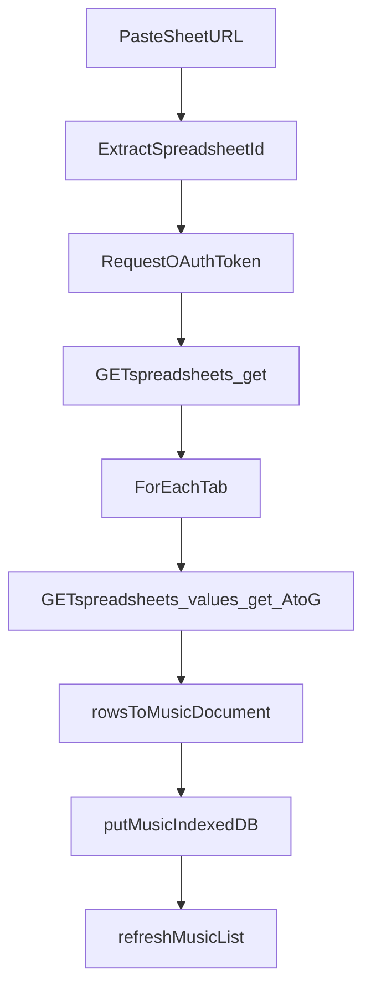

# Google Sheets Import To IndexedDB

## Scope
Implement Google Sheets integration using browser OAuth (Google Identity Services), so users can paste a Sheets URL and import all tabs as separate `MusicDocument` records into IndexedDB.

## Files To Update
- [index.html](/home/separovich/dev/discover-musical-show-helper-prompt/index.html)
- [ui-v2.css](/home/separovich/dev/discover-musical-show-helper-prompt/ui-v2.css)
- [src/main.ts](/home/separovich/dev/discover-musical-show-helper-prompt/src/main.ts)
- [src/csvMusic.ts](/home/separovich/dev/discover-musical-show-helper-prompt/src/csvMusic.ts)
- [src/db.ts](/home/separovich/dev/discover-musical-show-helper-prompt/src/db.ts)
- Add: [src/googleSheets.ts](/home/separovich/dev/discover-musical-show-helper-prompt/src/googleSheets.ts)

## Implementation Plan
1. **Add Google Sheets service module** in `src/googleSheets.ts`:
   - Parse spreadsheet ID from pasted URLs like `https://docs.google.com/spreadsheets/d/{id}/...`.
   - Initialize Google Identity Services token client using `G_CLOUD_CLIENT_ID` from Vite env (`import.meta.env`).
   - Call `GET /v4/spreadsheets/{spreadsheetId}` to enumerate sheet/tab names.
   - For each tab, call `GET /v4/spreadsheets/{spreadsheetId}/values/{range}` with default range `A:G` (or `'<sheetName>'!A:G`).
   - Return normalized structures for import, including tab title and `values` rows.

2. **Add a values-to-document transformer** in `src/csvMusic.ts`:
   - Reuse existing CSV mapping logic by adding a `rowsToMusicDocument(rows: string[][])` helper.
   - Keep `csvTextToMusicDocument()` behavior unchanged by making it delegate to the new helper after parsing CSV.
   - Use the same header mapping (`Compassos`, `Description`, `Letra`, `Cifra`, `Conf`, `Conf-Val`) to preserve output parity with `csvs/example.csv`.

3. **Extend IndexedDB import semantics** in `src/db.ts` (non-breaking):
   - Reuse `putMusic()` as-is.
   - Define record ID format for Sheets imports to avoid collisions and support re-import updates, e.g. `gsheet:{spreadsheetId}:{sheetIdOrTitle}`.
   - Keep list and delete behavior unchanged because records still follow `StoredMusic`.

4. **Add UI for Sheets import** in `index.html` + `ui-v2.css`:
   - Add an “Import from Google Sheets” panel with:
     - URL input
     - optional range input defaulting to `A:G`
     - Import button
     - status/error text area
   - Keep existing CSV auto-sync panel intact.

5. **Wire import flow in `src/main.ts`**:
   - On Import click:
     - Validate URL and extract spreadsheet ID.
     - Trigger OAuth token request if token missing/expired.
     - Fetch spreadsheet metadata (all tabs), fetch each tab values, convert to `MusicDocument`, save each as a separate `StoredMusic` record.
     - Refresh library list and display import summary (`N tabs imported`, plus tab failures if any).
   - Add graceful error handling for auth denied, invalid URL, 403/404, empty tab data, and schema mismatch.

6. **Validation and sanity checks**:
   - Confirm imported data is rendered by existing prompter and metronome logic without changes.
   - Verify repeated import updates the same records (stable IDs) instead of duplicating uncontrolled entries.

## Data Flow

## Key Notes
- `spreadsheets.values.get` and `spreadsheets.get` are plain HTTP endpoints exposed via gRPC transcoding conventions; browser calls remain standard REST requests.
- Default range remains `A:G` to match your CSV schema columns.
- Importing all tabs as separate records preserves your current one-music-per-record model and minimizes downstream changes.