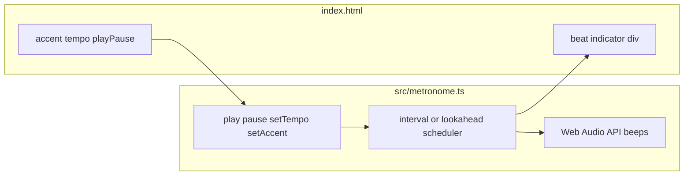

# TypeScript metronome module + HTML UI

## Clarification

You wrote **tempo as “beats per second”** but also **default 120 bpm**. A metronome almost always uses **beats per minute (BPM)**; 120 BPM is standard. The plan uses **BPM** everywhere. If you truly wanted beats per second, that would be a different scale (120 BPS would be unusably fast).

## Architecture

- `**[src/metronome.ts](src/metronome.ts)**` (single module): exports a small factory or class that encapsulates:
  1. **Play / pause** — `play()`, `pause()` (and optionally `toggle()` or `get playing()`).
  2. **Tempo** — `setTempo(bpm: number)` with internal default **120**; clamp to a sane range (e.g. 30–300).
  3. **Accent** — `setAccent(n: number)` where **n ≥ 1**: every **n** beats the first has accent, with higher pitch and volume.
- **Audio**: use the **Web Audio API** (`AudioContext`, `OscillatorNode` + `GainNode`) for short clicks; use a **higher frequency or higher gain** on accented beats so the difference is obvious without external sound files.
- **Visual**: accept an optional callback from the module, e.g. `onBeat({ beatIndex, accented })`, or pass a `HTMLElement` ref — the HTML page wires this to toggle a CSS class / background color on the indicator **div** for the duration of the beep (e.g. ~50–100 ms), then clear it.

**Scheduling note:** For a simple metronome, `setInterval`/`setTimeout` driven by BPM is acceptable. If you want tighter timing later, a lookahead scheduler with `AudioContext.currentTime` is an upgrade; not required for v1.

## HTML and entry

- `**[index.html](index.html)`** at project root (Vite convention): three controls — **accent** (number input), **tempo** (number input, default 120), **play/pause** (button) — plus the **colored div** for the flash.
- `**[src/main.ts](src/main.ts)`** (or inline logic in a second small file): imports the metronome module, binds DOM events, calls `setAccent` / `setTempo` / `play` / `pause`, and updates the div on each beat.

## Tooling (TypeScript in the browser)

Because the browser cannot run `.ts` directly, use **Vite** as the dev server and bundler/transpiler:

- Add devDependencies: `typescript`, `vite`, and `@types/node` only if needed (often unnecessary for this scope).
- Add `[tsconfig.json](tsconfig.json)` with `"target": "ES2022"` (or ES2020), `"module": "ESNext"`, `"strict": true`, `"moduleResolution": "bundler"`.
- Set `[package.json](package.json)` `"type": "module"`, scripts: `"dev": "vite"`, `"build": "vite build"`, `"preview": "vite preview"`.
- Point Vite at root `index.html` (default).

No extra UI framework; vanilla DOM is enough.

## Files to add or change

| Action | File                                                                                           |
| ------ | ---------------------------------------------------------------------------------------------- |
| Edit   | `[package.json](package.json)` — scripts, `type`, devDependencies                              |
| Add    | `[tsconfig.json](tsconfig.json)`                                                               |
| Add    | `[vite.config.ts](vite.config.ts)` — optional minimal config (empty export is fine)            |
| Add    | `[src/metronome.ts](src/metronome.ts)` — core API + audio + beat callback                      |
| Add    | `[src/main.ts](src/main.ts)` — wire UI                                                         |
| Add    | `[index.html](index.html)` — controls + indicator div, script `type="module"` → `/src/main.ts` |

## Acceptance checklist

- Module exposes play/pause, tempo (BPM, default 120), and accent (every nth beat).
- HTML offers the three controls and imports the built module via Vite dev (`npm run dev`).
- Each beat plays an audible click; nth beats sound clearly accented.
- Indicator div shows a visible color while the beep fires, then returns to idle styling.

